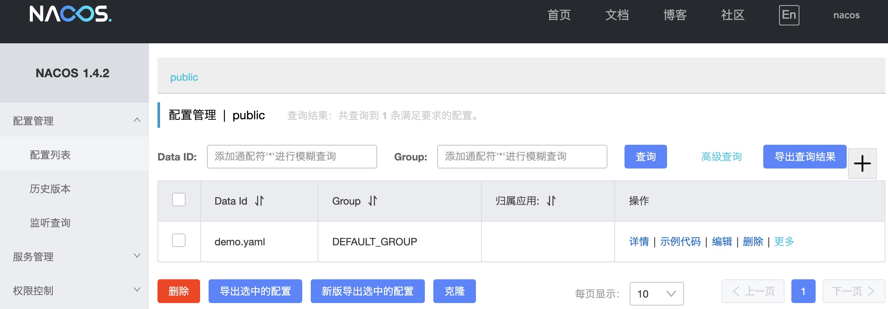

# nacos 注册中心的简单使用

代码: 【nacos/nacos-config-simple】

总结，要使用 nacos 的注册中心功能，只需要以下简单的几步：

1. 引入 `spring-cloud-starter-alibaba-nacos-config` 包
2. 配置 `bootstrap.xml`
3. 在注册中心配置注册数据
4. 在代码中使用 `@Value("${XXX}")` 引入配置项
5. 如果希望监听注册中心的配置数据变化，添加 `@RefreshScope` 即可

## pom 中引入 nacos-config

```xml
<dependency>
    <groupId>com.alibaba.cloud</groupId>
    <artifactId>spring-cloud-starter-alibaba-nacos-config</artifactId>
</dependency>
```

## 配置 bootstrap.yaml

```yaml
spring:
  cloud:
    nacos:
      config:
        prefix: demo
        file-extension: yaml
      server-addr: localhost:8848
```

## 在 nacos 的 web 页面配置



这里注意，*bootstrap.yaml* 没有指定 namespace，则使用 public，没有指定 group，则使用 DEFAULT_GROUP，由 prefix 和 file-extension 组合成配置的 Data id：*demo.yaml*，其内容为：
```yaml
demo:
  name: abc
```

## 从 nacos 获取配置信息

通过 `$Value("${demo.name}")` 即可获取配置：
```java
@RestController
public class MyController {
    @Value("${demo.name}")
    private String demoName;

    @GetMapping("/foo")
    public String foo() {
        return demoName;
    }
}
```
但此时，修改配置中心的值，并不能使 demoName 成员的值改变，需要添加注解 `@RefreshScope`:

```java
@RestController
@RefreshScope
public class MyController {
    @Value("${demo.name}")
    private String demoName;

    @GetMapping("/foo")
    public String foo() {
        return demoName;
    }
}
```
此时，修改注册中心的值，`demoName` 的值也将被改变。
