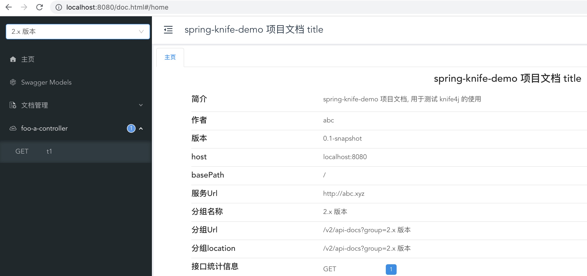

# springboot 整合 knife4j 

参考：[Spring Boot 框架集成Knife4j](https://doc.xiaominfo.com/knife4j/action/springboot.html)

第一步：引入 knife4j 包

```xml
<dependency>
    <groupId>com.github.xiaoymin</groupId>
    <artifactId>knife4j-spring-boot-starter</artifactId>
    <version>3.0.3</version>
</dependency>
```

第二步：创建Swagger配置类

```java

import org.springframework.context.annotation.Bean;
import org.springframework.context.annotation.Configuration;
import springfox.documentation.builders.ApiInfoBuilder;
import springfox.documentation.builders.PathSelectors;
import springfox.documentation.builders.RequestHandlerSelectors;
import springfox.documentation.service.Contact;
import springfox.documentation.spi.DocumentationType;
import springfox.documentation.spring.web.plugins.Docket;
import springfox.documentation.swagger2.annotations.EnableSwagger2;

@Configuration
@EnableSwagger2
public class Knife4jConfiguration {
    @Bean(value = "defaultApi2")
    public Docket defaultApi2() {
        Docket docket = new Docket(DocumentationType.SWAGGER_2)
                .apiInfo(new ApiInfoBuilder()
                        .title("spring-knife-demo 项目文档 title")
                        .description("spring-knife-demo 项目文档, 用于测试 knife4j 的使用")
                        .termsOfServiceUrl("http://abc.xyz")
                        .contact(new Contact("abc", "fff.com", "abc@qq.com"))
                        .version("0.1-snapshot")
                        .build())
                .groupName("2.x 版本")
                .select()
                // 定义 Controller 扫描包路径
                .apis(RequestHandlerSelectors.basePackage("com.bfh.controller.foo"))
                .paths(PathSelectors.any())
                .build();
        return docket;
    }
}
```

第三步：写 web 服务代码，最终的文件结构为：

```
src/main/java
└── com
    └── bfh
        ├── SpringKnifeDemoMain.java
        ├── config
        │   └── Knife4jConfiguration.java
        └── controller
            ├── bar
            │   └── BarBController.java
            └── foo
                └── FooAController.java
```

最终的结果为：


